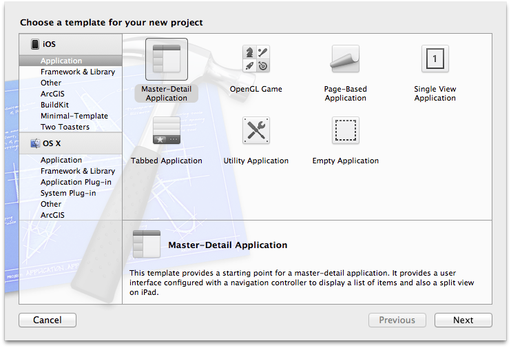
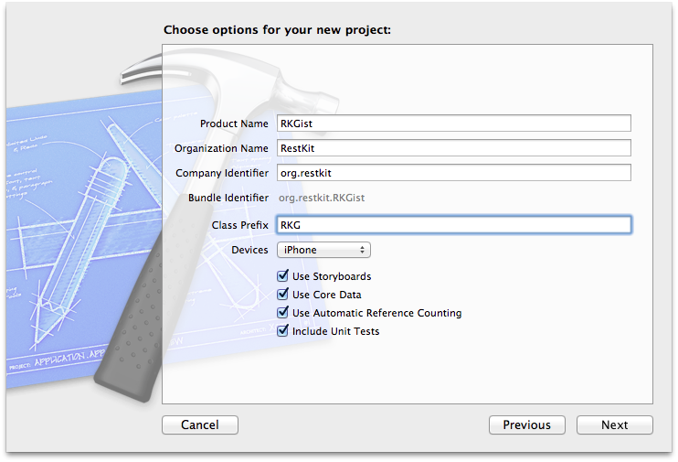
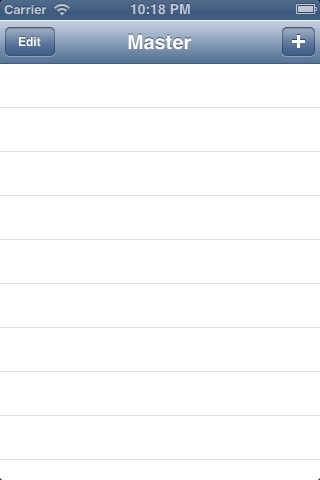
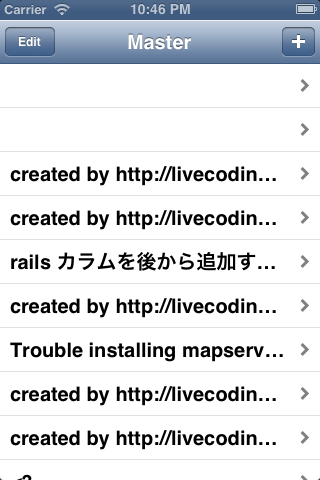
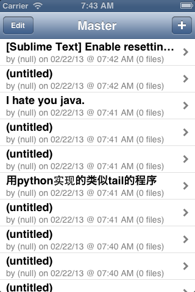

# Getting Acquainted with RestKit
> _This guide is current as of RestKit **v0.20.0**._

This guide provides an introduction to the RestKit framework for iOS and Mac OS X. After reading it, you should have an understanding of the following topics:

1. What RestKit is and the benefits of adopting it for your next iOS or Mac OS X project.
2. How RestKit is designed and the philosophy of the library.
3. How to install RestKit into an application and begin interacting with a web service.
4. How RestKit interfaces with Core Data.
5. How RestKit provides abstractions for interacting with web service API's

## Guide Assumptions

This guide is designed for beginners who want to get started with a RestKit application from scratch. It does not assume that you have any prior experience with RestKit. It does, however, assume that the you have a basic understanding of Cocoa development and have some pre-requisites installed:

* [Xcode](https://itunes.apple.com/us/app/xcode/id497799835?mt=12) version >= 4.6
* [CocoaPods](http://cocoapods.org/) version >= 1.6.2

RestKit is a framework for implementing web service API client applications on iOS and Mac OS X in the Objective-C programming language. If you have no prior experience with Cocoa and Objective-C, then you will face a very steep learning curve if you attempt to dive straight into RestKit. It is recommended that you not attempt to drink the ocean by tackling Objective-C, Cocoa, and RestKit all at once. There are numerous resources available online for getting started with Cocoa development and this guide will be here once you have established a firm grounding in the basics of Cocoa development.

If you already have a handle on the basics of Cocoa development, then there are a few specific technologies and patterns that you will need to be familiar with in order to get the most out of this guide:

* [REST](http://www.ics.uci.edu/~fielding/pubs/dissertation/top.htm) - REST is an acronym for Representational State Transfer and describes an architectural pattern for implementing interapplication communication in distributed systems such as the World Wide Web. RestKit provides a set of tools for implementing RESTful client applications in Cocoa/Objective-C.
* [Key-Value Coding](http://developer.apple.com/library/mac/#documentation/Cocoa/Conceptual/KeyValueCoding/Articles/KeyValueCoding.html) - Key-Value coding is a mechanism for expressing indirect read/write access to properties by name. It is implemented as an informal protocol that is adopted by `NSObject` and underpins many Cocoa technologies such as key-value observation, Core Data, and bindings. KVC is the enabling technology for the object mapping system in RestKt.
* [NSOperation](http://developer.apple.com/library/mac/#documentation/Cocoa/Reference/NSOperation_class/Reference/Reference.html) - The `NSOperation` class is a Cocoa Foundation abstract class that encapsulates the code and data associated with a single task. Much of RestKit is implemented as `NSOperation` subclasses.
* [Core Data](http://developer.apple.com/library/mac/#documentation/cocoa/Conceptual/CoreData/cdProgrammingGuide.html) - Core Data is an object graph management and persistence framework provided by Apple with the Mac OS X and iOS SDKs. RestKit provides strong support for integrating a RESTful web service API with client-side persistence backed by Core Data.
* [Objective-C Runtime](https://developer.apple.com/library/mac/#documentation/Cocoa/Conceptual/ObjCRuntimeGuide/Introduction/Introduction.html) - Objective-C is a highly dynamic language implemented on top of the C programming language. The runtime provides much of the dynamic functionality of the language. RestKit leverages many features of the runtime in the implementation of the object mapping engine. For the purposes of this guide, it is sufficient for the reader to simply be aware that Objective-C provides dynamic functionality such as runtime type inspection, declared property introspection, and message forwarding.
* [AFNetworking](http://afnetworking.org/) - AFNetworking is a "delightful networking library for iOS and Mac OS X". RestKit is implemented on top of the networking primitives provided by AFNetworking.

## What is RestKit?

> This section provides background and philosophy of RestKit in details. You can safely skip this section and come back to it at a later time. The next section begins the hand's on exploration of working with RestKit.

RestKit is a modern Objective-C framework for implementing RESTful web service client applications on iOS and Mac OS X. It is designed to make the development of your application easier by providing a system for binding your application's data model with the JSON or XML documents emitted by the web service you are communicating with. It enables you to write less code by shifting many application concerns into the library. It also speeds development by providing out-of-the-box solutions and patterns for tackling many common problems you will face when implementing your application -- particularly when integrating with Core Data. Experienced developers also find that RestKit enables a more satisfying and more maintainable code base because it encourages cleanliness and testability as core values.

RestKit is opinionated software. It makes a number of assumptions about your backend API and encourages the adoption of several design patterns in your Cocoa application code. Not every API is suitable for integration with RestKit -- particularly those that follow remote procedure call (RPC) semantics. When evaluating RestKit for use in your project, you should consider how closely your API and application design conform to the following assumptions:

* Your backend API is RESTful or at least "REST-ish". Interactions with your web application can be described in terms of resources and operations performed on those resources.
* Your backend API and your application's data model should be designed independently around what makes the most sense for each application. RestKit provides the tools for expressing the connection between these designs cleanly and simply.
* You think of your API in terms of objects that are accessed and manipulated, rather than requests made and responses processed. HTTP is a transfer medium and an implementation detail rather than a primary concern.
* Testability is a primary concern in your project. You believe in executable tests that verify behavior as a design and development tool. RestKit encourages the use of unit and functional testing for your application and provides tools for adopting a test-driven development style.

### RestKit Components

RestKit is shipped as a single library that is composed of several individual components collaborating to form a cohesive framework. Each component is designed with minimal dependencies and is usable as a standalone library. Each of these components is explained briefly below. Don't worry about attempting to understand the low-level details of each component now -- we'll explore each in detail later. For now, try to focus on the functionality provided by each component and grasp the layering of each component within the overall architecture.

#### Object Mapping

The Object Mapping component provides the lion's share of the functionality within RestKit. The Object Mapping system provides a mechanism for expressing the transformation of objects between representations using key-value coding and the dynamic features of the Objective-C runtime.

#### Networking

The Networking component provides integration between the Object Mapping component and HTTP networking primitives provided by AFNetworking. Services provided by the Networking component include the serialization and deserialization wire formats (such as JSON/XML), the binding of Object Mapping descriptions with HTTP requests and responses, the generation of URL's via routing, and the parameterization of local objects into HTTP parameters. This component includes many of the most used classes, such as the object manager and object request operation.

#### Core Data

The Core Data component provides integration between the RestKit Object Mapping and Networking components and Apple's Core Data modeling and persistence framework. This component mostly includes specialized implementations of classes provided by the Object Mapping and Networking layers, but also includes additional functionality specific to Core Data such as relationship connection descriptions.

##### Search

A subset of the Core Data component -- the Search component provides support for the indexing and searching of managed objects. The component includes a tokenizer, indexer, and convenience API's for generating search predicates that can be used to query indexed objects.

#### Testing

The Testing component includes several classes to make unit testing object mapping straightforward. Also included is a lightweight object factory implementation, which makes it easy to build reusable test fixtures. The testing classes are agnostic about the testing library you use and work easily with SenTest, Kiwi, Specta, Cedar, etc.

## Getting Up and Running

RestKit is distributed as a single library containing several sub-components. There are two supported installation methods:

1. [Automatic configuration via CocoaPods](https://github.com/RestKit/RestKit/wiki/Installing-RestKit-v0.20.x-via-CocoaPods) - This is the recommended approach as CocoaPods handles the linker flags, header paths, and download of source code dependencies on your behalf.
2. [Manual configuration as a submodule](https://github.com/RestKit/RestKit/wiki/Installing-RestKit-v0.20.x-as-a-Git-Submodule) - This method involves adding a submodule to your project and building RestKit as a dependency. You are responsible for configuring the project appropriately.

Before proceding with the tutorial, you should familiarize yourself with the installation method of your choosing.

## Creating the RKGist Application

The remainder of this guide is organized as a step-by-step tutorial designed to walk you through the basics of working with RestKit to implement access to an API. Each sections builds on its predecessors, so the best approach is to work through each section one at a time in the order presented. You can obtain a complete copy of the completed tutorial application [on Github](http://github.com/RestKit/RKGist).

By following this guide, you'll be creating an iOS application with RestKit called `RKGist`, a very simple client for [Github's Gist application](https://gist.github.com/). We've selected Gist for this tutorial because it is very well known, has a relatively simple API, and is very [well documented](http://developer.github.com/v3/gists/). We'll explore a large subset of the RestKit API's in a task based fashion, introducing new functionality and concepts as they enter the purview of the application being developed. 

### Creating the iOS Application

To begin creating the application, Open Xcode and select the "File" menu, then "New Project…". You will be presented with a new Xcode window displaying the template selection sheet. Select the "Master-Detail Application" template under the "iOS" and hit the "Next" button.



On the next screen, configure the options for your project by setting the *Product Name* to "RKGist", specifying a *Class Prefix* of "RKG" and then enabling the following options:

* Use Storyboard
* Use Core Data
* Use Automatic Reference Counting
* Include Unit Tests

Hit the "Next" button and save your new project to an appropriate place on disk.



### Installing RestKit via CocoaPods

Once your project has been created, you'll need to add RestKit to it using [CocoaPods](http://cocoapods.org/). To do so, open up your Terminal application and navigate to the location on disk where you saved the RKGist application. From there, install CocoaPods by executing the following commands on your Terminal:

```sh
$ [sudo] gem install cocoapods
$ pod setup
```
You can now add RestKit to your project by creating a new Podfile:

```sh
$ edit Podfile
```

Your favorite editor will open and allow you to configure your dependencies. Input the following into your Podfile:

```ruby
platform :ios, 6.0
target "RKGist" do
    pod 'RestKit', '~> 0.20.0rc'
# Include optional Testing and Search components
    pod 'RestKit/Testing', '~> 0.20.0rc'
    pod 'RestKit/Search', '~> 0.20.0rc'
end

# Import Expecta for Testing
target "RKGistTests" do
    pod 'Expecta', '0.2.1'
end
```

Invoke CocoaPods to install the dependencies:

```sh
$ pod install
```

CocoaPods will configure your project for use and create a new Workspace file. Open up `RKGist.xcworkspace` and then open the `RKGist-Prefix.pch` file from within the **RKGist** > **Supporting Files** group in the workspace. Set the files content to:

```objc
//
// Prefix header for all source files of the 'RKGist' target in the 'RKGist' project
//

#import <Availability.h>

#ifndef __IPHONE_5_0
#warning "This project uses features only available in iOS SDK 5.0 and later."
#endif

#ifdef __OBJC__
    #import <UIKit/UIKit.h>
    #import <Foundation/Foundation.h>
    #import <CoreData/CoreData.h>
#endif

#if __IPHONE_OS_VERSION_MIN_REQUIRED
    #import <SystemConfiguration/SystemConfiguration.h>
    #import <MobileCoreServices/MobileCoreServices.h>
#else
    #import <SystemConfiguration/SystemConfiguration.h>
    #import <CoreServices/CoreServices.h>
#endif

// Make RestKit globally available
#import <RestKit/RestKit.h>

```

These changes to the pre-compiled header file ensure that RestKit and AFNetworking enable support for reachability and MIME type inference. Your project is now ready to go and we can begin the first task.

## Reading Gists

For many RestKit applications, the first real usage of the library involves a read operation against a backend API. In this section, we'll implement read-only access to the Gist service and explore a number of RestKit API's in doing so.

### Data Modeling

At its core, RestKit is a system for binding your application's data model with a remote object representation retrieved via HTTP. Before we can do any sort of mapping between our application and the web service API we wish to communicate with, we need to understand how the remote object representation is structured and compose a local data model to hold the information we are interested in.

We'll begin working with the Gist API by retrieving the list of public Gists and mapping them into a table view within our iOS application. If you take a read through the [Github API v3 documentation](http://developer.github.com/v3/gists/) about the Gist resource, you'll see that an HTTP GET on the "/gists/public" resource will return all public gists. This is a great starting point for our application -- there is no authentication needed. Feel free to load up and browse a payload of current public gists by pointing your browser at [https://api.github.com/gists/public](https://api.github.com/gists/public). You'll find that the JSON retrieved looks something like this:

```json
{
    "url": "https://api.github.com/gists/4774273",
    "forks_url": "https://api.github.com/gists/4774273/forks",
    "commits_url": "https://api.github.com/gists/4774273/commits",
    "id": "4774273",
    "git_pull_url": "https://gist.github.com/4774273.git",
    "git_push_url": "https://gist.github.com/4774273.git",
    "html_url": "https://gist.github.com/4774273",
    "files": {
        "gistfile1.txt": {
            "filename": "gistfile1.txt",
            "type": "text/plain",
            "language": null,
            "raw_url": "https://gist.github.com/raw/4774273/b8737fef0dd6403b2dc5d51b6fb2fd0a9141f484/gistfile1.txt",
            "size": 58
        }
    },
    "public": true,
    "created_at": "2013-02-12T22:58:52Z",
    "updated_at": "2013-02-12T22:58:53Z",
    "description": "My first gist!",
    "comments": 0,
    "user": {
        "login": "RKGistExample",
        "id": 3541778,
        "avatar_url": "https://secure.gravatar.com/avatar/cccf809ee0b340976d241cb93cc0b601?d=https://a248.e.akamai.net/assets.github.com%2Fimages%2Fgravatars%2Fgravatar-user-420.png",
        "gravatar_id": "cccf809ee0b340976d241cb93cc0b601",
        "url": "https://api.github.com/users/RKGistExample",
        "followers_url": "https://api.github.com/users/RKGistExample/followers",
        "following_url": "https://api.github.com/users/RKGistExample/following",
        "gists_url": "https://api.github.com/users/RKGistExample/gists{/gist_id}",
        "starred_url": "https://api.github.com/users/RKGistExample/starred{/owner}{/repo}",
        "subscriptions_url": "https://api.github.com/users/RKGistExample/subscriptions",
        "organizations_url": "https://api.github.com/users/RKGistExample/orgs",
        "repos_url": "https://api.github.com/users/RKGistExample/repos",
        "events_url": "https://api.github.com/users/RKGistExample/events{/privacy}",
        "received_events_url": "https://api.github.com/users/RKGistExample/received_events",
        "type": "User"
    },
    "comments_url": "https://api.github.com/gists/4774273/comments"
}
```

There's a fair bit of information available to us in this payload -- likely more than we need to handle in our app. We can begin the data modeling processing by asking: What information is necessary to implement the user interface? Since we are planning to display a table view listing gists, we can probably get away with modeling the following attributes:

* `id` - The unique identifier for the gist
* `url` - The URL from which we can obtain the full JSON representation of the gist
* `html_url` - The URL from which we can obtain an HTML representation of the gist
* `description` - A description of the gist's content
* `public` - A Boolean value that indicates if the gist is public
* `created_at` and `updated_at` - String values specifying the time when the gist was created and the last time it was updated, respectively

In addition to the gist itself, we also have a secondary object representation available within the JSON -- the user who created the gist. Within this representation, there are a few attributes of interest:

* `id` - The unique identifier for the user
* `login` - The user's Github username
* `avatar_url` - The URL from which we can load the user's avatar image
* `url` - The URL from which we can obtain the full JSON representation of the user

### Creating the Core Data Entities

Now that we've identified the interesting information from our JSON object representations, we need to create data models within our Cocoa application to encapsulate the data. For the purposes of this guide, we'll use Apple's Core Data persistence framework for our modeling needs. Its worth noting that RestKit does not require the use of Core Data -- you are free to model your objects as plain old `NSObject` derived classes if you wish. In fact, you can mix managed and unmanaged objects within the same request.

To create the Core Data entities for the RKGist application, open the workspace in Xcode and open the `RKGist.xcdatamodeld` file. Delete any existing entities in the model that were generated by the project template. Show the right hand Utilities panel by clicking the far right button in the **View** section of the Xcode toolbar (or type Apple+Option+0). Next, press the **Add Entity** button along the bottom of the Xcode editor and input `Gist`. Now navigate to the **Attributes** section and click the **+** once for each of the following attributes and configure them as described in the table below:

<table>
<tr>
	<th>Attribute Name</th>
	<th>Type</th>	
<tr>
	<td>gistID</td>
	<td>Integer 32</td>
</tr>
<tr>
	<td>jsonURL</td>
	<td>Transformable</td>
</tr>
<tr>
	<td>htmlURL</td>
	<td>Transformable</td>
</tr>
<tr>
	<td>descriptionText</td>
	<td>String</td>
</tr>
<tr>
	<td>public</td>
	<td>Boolean</td>
</tr>
<tr>
	<td>createdAt</td>
	<td>Date</td>
</tr>
<tr>
	<td>updatedAt</td>
	<td>Date</td>
</tr>
</table>

Next, hit the **Add Entity** button again to create a second entity and input the name `User`. We'll use this entity to model the users who have created and forked gists. Configure the attributes as follows:

<table>
<tr>
	<th>Attribute Name</th>
	<th>Type</th>	
<tr>
	<td>userID</td>
	<td>Integer 32</td>
</tr>
<tr>
	<td>jsonURL</td>
	<td>Transformable</td>
</tr>
<tr>
	<td>login</td>
	<td>String</td>
</tr>
<tr>
	<td>gravatarID</td>
	<td>String</td>
</tr>
<tr>
	<td>avatarURL</td>
	<td>Transformable</td>
</tr>
</table>

Once the `User` entity has been configured, create a final entity called `File` to model the information about each file within a `Gist`. Configure the attributes as follows:

<table>
<tr>
	<th>Attribute Name</th>
	<th>Type</th>	
<tr>
	<td>filename</td>
	<td>String</td>
</tr>
<tr>
	<td>rawURL</td>
	<td>Transformable</td>
</tr>
<tr>
	<td>size</td>
	<td>Integer 32</td>
</tr>
</table>

Once all the attributes have been created, repeat the process for the relationships. As the relationships refer across entities, they are presented in a single table below. It's recommended that you do the configuration in the **Utilities** panel on the right of the Xcode window, as you cannot configure all of the relationship properties in the main panel. The relationships are as follows:

<table>
<tr>
	<th>Entity</th>
	<th>Relationship Name</th>
	<th>Destination</th>
	<th>Inverse</th>
	<th>Plural To-Many Relationship</th>
<tr>
	<td>File</td>
	<td>gist</td>
	<td>Gist</td>
	<td>files</td>
	<td>Not Checked</td>
</tr>
<tr>
	<td>Gist</td>
	<td>files</td>
	<td>File</td>
	<td>gist</td>
	<td>Checked</td>
</tr>
<tr>
	<td>Gist</td>
	<td>user</td>
	<td>User</td>
	<td>gists</td>
	<td>Not Checked</td>
</tr>
<tr>
	<td>User</td>
	<td>gists</td>
	<td>Gist</td>
	<td>user</td>
	<td>Checked</td>
</tr>
</table>

### Configuring RestKit & Core Data

Now that the data model is configured, we can proceed to configuring the application to use RestKit. Open up `RKGAppDelegate.h` and replace the interface definition for `RKGAppDelegate` with the following:

``` objc
@interface RKGAppDelegate : UIResponder <UIApplicationDelegate>
@property (strong, nonatomic) UIWindow *window;
@end
```

This remove the Core Data generated accessors from the interface, which are unnecessary when using RestKit's core data configuration. Next, switch to the implementation of the app delegate in `RKGAppDelegate.m` and replace its content with the following:

```objc
#import <RestKit/RestKit.h>
#import "RKGAppDelegate.h"
#import "RKGMasterViewController.h"

@implementation RKGAppDelegate

- (BOOL)application:(UIApplication *)application didFinishLaunchingWithOptions:(NSDictionary *)launchOptions
{
    NSError *error = nil;    
    NSURL *modelURL = [NSURL fileURLWithPath:[[NSBundle mainBundle] pathForResource:@"RKGist" ofType:@"momd"]];
    // NOTE: Due to an iOS 5 bug, the managed object model returned is immutable.
    NSManagedObjectModel *managedObjectModel = [[[NSManagedObjectModel alloc] initWithContentsOfURL:modelURL] mutableCopy];
    RKManagedObjectStore *managedObjectStore = [[RKManagedObjectStore alloc] initWithManagedObjectModel:managedObjectModel];
    
    // Initialize the Core Data stack
    [managedObjectStore createPersistentStoreCoordinator];
    
    NSPersistentStore __unused *persistentStore = [managedObjectStore addInMemoryPersistentStore:&error];
    NSAssert(persistentStore, @"Failed to add persistent store: %@", error);
    
    [managedObjectStore createManagedObjectContexts];
    
    // Set the default store shared instance
    [RKManagedObjectStore setDefaultStore:managedObjectStore];
    
    // Override point for customization after application launch.
    UINavigationController *navigationController = (UINavigationController *)self.window.rootViewController;
    RKGMasterViewController *controller = (RKGMasterViewController *)navigationController.topViewController;
    controller.managedObjectContext = managedObjectStore.mainQueueManagedObjectContext;
    return YES;
}

@end
```

You'll notice that the size of the file has been reduced considerably. What we've done here is switched from using the Apple generated Core Data boilerplate over to using a RestKit provided implementation by the [`RKManagedObjectStore`](http://restkit.org/api/latest/Classes/RKManagedObjectStore.html) class. `RKManagedObjectStore` encapsulates all the functionality for setting up a Core Data stack and provides you with a `NSManagedObjectContext` configuration that is optimized for performance. 

When you invoke `createManagedObjectContexts`, the store creates a pair of managed object contexts arranged in a parent-child hierarchy. The contexts are as follows:

* `persistentStoreManagedObjectContext` - This is the 'root' context for the store and has a direct relationship with the `persistentStoreCoordinator`. The context is initialized with the `NSPrivateQueueConcurrencyType` so that it will perform its I/O operations off of the main thread.
* `mainQueueManagedObjectContext` - This context is a child of the `persistentStoreManagedObjectContext` and is initialized with the `NSMainQueueConcurrencyType`. The main queue context is suitable for general purpose usage in your app's user interface. 

The context arrangement can be visually understood by reviewing the following graphic:

// TODO: [INSERT GRAPHIC HERE SHOWING THE MOC CONFIGURATION]

The store also takes care of merging changes from the persistent store context into the main queue when a save operation completes.

### Mapping the Gist

Now that we've tackled configuration of the Core Data managed object model and set up the Core Data stack, we can begin loading the public gists and displaying them in our table view. We'll start off with a very simple display format -- showing only the name of the gist and the user who created it -- then progress to mapping the full gist representation and implement a more compelling user interface.

To get started, open up `RKGMasterViewController.m` file and navigate to the `fetchedResultsController` method. Change the configuration of the `NSEntityDescription` from the `Event` entity to the `Gist` entity:

```diff
- NSEntityDescription *entity = [NSEntityDescription entityForName:@"Event" inManagedObjectContext:self.managedObjectContext];
+ NSEntityDescription *entity = [NSEntityDescription entityForName:@"Gist" inManagedObjectContext:self.managedObjectContext];
```

Then update the sort descriptors so that the controller is configured to sort on the `createdAt` attribute instead of `timeStamp`:

```diff
- NSSortDescriptor *sortDescriptor = [[NSSortDescriptor alloc] initWithKey:@"timeStamp" ascending:NO];
+ NSSortDescriptor *sortDescriptor = [[NSSortDescriptor alloc] initWithKey:@"createdAt" ascending:NO];
```

You should now be able to build & run the app via the **Product** > **Run** menu (or hit Apple+R). The application should start as expected and show you an empty table view similar to the following:



The application is now configured for displaying Gist objects from Core Data, but there's a problem -- there aren't any in the store to display! We'll remedy this by introducing RestKit into the mix to load some Gist objects from Github to populate the table view.

Switch to the `viewDidLoad` method and append the following code to the bottom of the method:

```objc
// Load the public Gists from Github
RKManagedObjectStore *managedObjectStore = [RKManagedObjectStore defaultStore];
RKEntityMapping *entityMapping = [RKEntityMapping mappingForEntityForName:@"Gist" inManagedObjectStore:managedObjectStore];
[entityMapping addAttributeMappingsFromDictionary:@{
 @"id":             @"gistID",
 @"url":            @"jsonURL",
 @"description":    @"descriptionText",
 @"public":         @"public",
 @"created_at":     @"createdAt"}];
    
RKLogConfigureByName("RestKit/Network", RKLogLevelTrace);
RKResponseDescriptor *responseDescriptor = [RKResponseDescriptor responseDescriptorWithMapping:entityMapping
                                                                                        method:RKRequestMethodGET
                                                                                   pathPattern:@"/gists/public"
                                                                                       keyPath:nil
                                                                                   statusCodes:RKStatusCodeIndexSetForClass(RKStatusCodeClassSuccessful)];
NSURLRequest *request = [NSURLRequest requestWithURL:[NSURL URLWithString:@"https://api.github.com/gists/public"]];
RKManagedObjectRequestOperation *managedObjectRequestOperation = [[RKManagedObjectRequestOperation alloc] initWithRequest:request responseDescriptors:@[ responseDescriptor ]];
managedObjectRequestOperation.managedObjectContext = self.managedObjectContext;
[[NSOperationQueue currentQueue] addOperation:managedObjectRequestOperation];
```

Then switch to the `configureCell:atIndexPath:` method and replace it with the following:

```objc
- (void)configureCell:(UITableViewCell *)cell atIndexPath:(NSIndexPath *)indexPath
{
    NSManagedObject *object = [self.fetchedResultsController objectAtIndexPath:indexPath];
    cell.textLabel.text = [[object valueForKey:@"descriptionText"] description];
}
```

Build and run the app again. You should now see a rather ugly table view that is populated with content. If you open up the Console panel within Xcode via the **View** > **Debug Area** > **Activate Console** menu (or via Apple+Shift+C), you'll see a complete dump of the JSON that was retrieved from the Gist service.



Now, quite a bit of magic has just taken place and its worth taking a step back to examine all of these pieces in depth. Let's first consider the process conceptually, then we'll take a look at the actual classes and methods that collaborate to implement the process. Conceptually, what we've just done is:

* Defined a new mapping describing a transformation between a JSON structure and the `Gist` entity stored in Core Data.
* Defined a binding between an HTTP response and the mapping for our `Gist` entity.
* Created and started an asynchronous HTTP request operation that is aware of our JSON -> model binding and capable of object mapping the response back into our `Gist` entity.
* Waited for the request to complete and the app to update the UI and display our Gist objects.

Let's now work through each part of the process in depth and get acquainted the RestKit API's we've just utilized.

#### Defining the Mapping

All RestKit mapping operations are driven by an **object mapping**. There are several types of mappings available, such as [`RKObjectMapping`](http://restkit.org/api/latest/Classes/RKObjectMapping.html), [`RKEntityMapping`](http://restkit.org/api/latest/Classes/RKEntityMapping.html), and [`RKDynamicMapping`](http://restkit.org/api/latest/Classes/RKDynamicMapping.html), but they all inherit from [`RKMapping`](http://restkit.org/api/0.20.0/Classes/RKMapping.html). `RKEntityMapping` is a subclass of `RKObjectMapping` that extends the base functionality with Core Data specific concepts. 

Since the `RKGist` application uses Core Data for persistence, we have created and instantiated an `RKEntityMapping`. Entity mappings are defined in terms of the Core Data entity that they will map object representations into. The designated initializer for `RKEntityMapping` is [`initWithEntity:`](http://restkit.org/api/latest/Classes/RKEntityMapping.html#//api/name/initWithEntity:), but it is common to use the convenience constructor [`mappingForEntityForName:inManagedObjectStore:`](http://restkit.org/api/latest/Classes/RKEntityMapping.html#//api/name/mappingForEntityForName:inManagedObjectStore:) to lookup the entity by name. We leveraged the shared instance accessor `[RKManagedObjectStore defaultStore]` to retrieve a reference to the managed object store we previously configured in the app delegate. We then provided the name of our entity and the managed object store instance to `mappingForEntityForName:inManagedObjectStore:` to lookup the entity by name and return a ready to use object mapping. 

You may notice that thus far we have not specified a destination class for objects created by the mapping -- we've only referred to entities. This is because Core Data does not require you to define a backing model class for the entity. The mapper will happily created `NSManagedObject` instances for you -- indeed this is what we've just done within `RKGist` as we have not yet created any model classes.

Once the mapping was initialized, we invoked [`addAttributeMappingsFromDictionary:`](http://restkit.org/api/latest/Classes/RKObjectMapping.html#//api/name/addAttributeMappingsFromDictionary:) with a dictionary whose keys correspond to the names of fields in the JSON example for a gist and whose values correspond to the names of attributes defined in the `Gist` entity we configured in the Core Data managed object model. This method is actually a convenience method whose implementation is:

```objc
- (void)addAttributeMappingsFromDictionary:(NSDictionary *)keyPathToAttributeNames
{
    for (NSString *attributeKeyPath in keyPathToAttributeNames) {
        [self addPropertyMapping:[RKAttributeMapping attributeMappingFromKeyPath:attributeKeyPath toKeyPath:[keyPathToAttributeNames objectForKey:attributeKeyPath]]];
    }
}
```

This illustrates an important point about `RKObjectMapping` (and through inheritance, `RKEntityMapping`): its simply a container class. Object mapping objects specify the destination class or entity for a mapping, but it is the [`RKPropertyMapping`](http://restkit.org/api/latest/Classes/RKPropertyMapping.html) objects that are added to it that define how attributes and relationships are mapped. `RKPropertyMapping` is an abstract superclass that has two concrete subclasses: [`RKAttributeMapping`](http://restkit.org/api/latest/Classes/RKAttributeMapping.html) and [`RKRelationshipMapping`](http://restkit.org/api/latest/Classes/RKRelationshipMapping.html). We've just worked with attribute mappings in `RKGist` via our invocation of `addAttributeMappingsFromDictionary:` -- the keys and values of the dictionary we provided were used to construct `RKAttributeMapping` objects and add them to the receiving `RKEntityMapping` object. When RestKit's object mapper kicks in later, it will process our parsed JSON document by iterating over the collection of property mappings, executing `valueForKeyPath:` to obtain a value at each source key path, perform any necessary transformations, and then set the transformed value at the destination key path.

// TODO: [INSERT GRAPHIC HERE SHOWING JSON -> MODEL]

#### Binding Mappings to HTTP Responses

After creating the entity mapping for the `Gist` entity, the next block of code establishes a binding between an HTTP response and the mapping:

```objc
RKResponseDescriptor *responseDescriptor = [RKResponseDescriptor responseDescriptorWithMapping:entityMapping method:RKRequestMethodAny pathPattern:@"/gists/public" keyPath:nil statusCodes:RKStatusCodeIndexSetForClass(RKStatusCodeClassSuccessful)];
```

Here we are introduced to the [`RKResponseDescriptor`](http://restkit.org/api/latest/Classes/RKResponseDescriptor.html) class, which is responsible for linking the object mapping system with HTTP responses. It is important to keep in mind that the object mapping engine is completely independent of dependencies on HTTP -- it's a generalized system for describing and executing the transformation of objects across representations. HTTP just happens to be a very common transport mechanism for object representations.

`RKResponseDescriptor` lets you describe the circumstances in which a given object mapping should be used to process an HTTP response. There are four properties available for configuration:

* `pathPattern` - The path pattern is a specially formatted string that is matched against the URL from which the HTTP response was loaded. The pattern can contain colon delimited dynamic components that identify the parts of your URL that can change. For example, consider the following URL for a gist at Github: `https://api.github.com/gists/4774273`. Within this URL, `4774273` represents the ID of a particular gist. This is a dynamic component of the URL that can change from request to request, but we know that every time a response is loaded from `/gists/XXXX` that the response will contain a representation of a Gist object. We can configure the response descriptor to match this URL by configuring a path pattern that matches it: `/gists/:gistID`. The `gistID` is interpreted as a dynamic component because it is prefixed with a colon.
* `method` - The HTTP method to be used in the request. Enum options available are:  RKRequestMethodPOST, RKRequestMethodPUT, RKRequestMethodDELETE, RKRequestMethodHEAD, RKRequestMethodPATCH, RKRequestMethodOPTIONS, RKRequestMethodAny
* `keyPath` - The key path identifies where in a parsed response document a given object representation may appear. Recall the previously mentioned importance of key-value coding. When a JSON or XML document is parsed, it is deserialized into an object graph structure composed of `NSArray` and `NSDictionary` objects. This object graph can be traversed using key-value coding. The key-path specified by the response descriptor tells RestKit that a given mapping applies to the subset of a deserialized response that can be obtained by executing `valueForKeyPath:`. This enables you to map different object types out of a single response or process only the subset of a response that you are interested in.
* `statusCodes` - The `statusCodes` property is an [`NSIndexSet`](https://developer.apple.com/library/mac/#documentation/Cocoa/Reference/Foundation/Classes/NSIndexSet_Class/Reference/Reference.html) that specifies the set of HTTP response codes for which a mapping is to be applied. In a RESTful application, the HTTP response codes are used to indicate the success or failure of requests. You can configure a response descriptor to only match the HTTP response codes that you expect the server to return a given representation with. For most API interactions, you typically expect a successful response of 200 or 201, but anything in the 2xx status code class is defined as successful according to the HTTP standard. You can explicitly configure your own `NSIndexSet` specifying the status codes for your descriptor or you can use the RestKit provided helper functions such as `RKStatusCodeIndexSetForClass` to quickly construct common values (see [`RKHTTPUtilities.h`](https://github.com/RestKit/RestKit/blob/development/Code/ObjectMapping/RKHTTPUtilities.h)). The `statusCodes` property figured prominently into the configuration of error mapping, which we'll explore in detail later in the guide.

In the `RKGist` application thus far we've configured a single response descriptor for our public gists API interaction that matches the entire response body (because the `keyPath` is nil) for any 2XX response loaded from the `/public/gists` path.

#### Object Request Operations

Armed with our object mapping and response descriptor, we can now actually perform an HTTP request and map the response. This task is performed by the [`RKObjectRequestOperation`](http://restkit.org/api/latest/Classes/RKObjectRequestOperation.html) class and its Core Data aware subclass [`RKManagedObjectRequestOperation`](http://restkit.org/api/latest/Classes/RKManagedObjectRequestOperation.html). We're introduced to object request operations in the `RKGist` application via the following code:

```objc
NSURLRequest *request = [NSURLRequest requestWithURL:[NSURL URLWithString:@"https://api.github.com/gists/public"]];
RKManagedObjectRequestOperation *managedObjectRequestOperation = [[RKManagedObjectRequestOperation alloc] initWithRequest:request responseDescriptors:@[ responseDescriptor ]];
managedObjectRequestOperation.managedObjectContext = self.managedObjectContext;
[[NSOperationQueue currentQueue] addOperation:managedObjectRequestOperation];
```

Object request operations are [`NSOperation`](http://developer.apple.com/library/mac/#documentation/Cocoa/Reference/NSOperation_class/Reference/Reference.html) subclasses that manage the lifecycle of a single HTTP request and process the response with the object mapping engine. Object request operations load a response by executing an [`RKHTTPRequestOperation`](http://restkit.org/api/latest/Classes/RKHTTPRequestOperation.html) to completion. `RKHTTPRequestOperation` is a thin subclass of the [`AFHTTPRequestOperation`](http://afnetworking.github.com/AFNetworking/Classes/AFHTTPRequestOperation.html) class from AFNetworking that adds support for instance level configuration of acceptable HTTP status codes and content types. Once an object request operation has loaded a [`NSHTTPURLResponse`](https://developer.apple.com/library/mac/#documentation/Cocoa/Reference/Foundation/Classes/NSHTTPURLResponse_Class/Reference/Reference.html), it passes the request and response objects and the `NSData` object containing the response body into an instance of [`RKResponseMapperOperation`](http://restkit.org/api/latest/Classes/RKResponseMapperOperation.html) along with the response descriptors to begin the object mapping process.

[`RKResponseMapperOperation`](http://restkit.org/api/latest/Classes/RKResponseMapperOperation.html) and its Core Data aware subclass [`RKManagedObjectResponseMapperOperation`](http://restkit.org/api/latest/Classes/RKManagedObjectResponseMapperOperation.html) are responsible for mapping an HTTP response and returning an [`RKMappingResult`](http://restkit.org/api/latest/Classes/RKMappingResult.html) or an `NSError` if the operation fails. The response is processed by deserializing the response body via the [`RKMIMETypeSerialization`](http://restkit.org/api/latest/Classes/RKMIMETypeSerialization.html) class and then evaluating all response descriptors by checking the path patterns and status codes. If any response descriptors match the response, then the deserialized response and the object mappings from the matching response descriptors is passed into an instance of [`RKMapperOperation`](http://restkit.org/api/latest/Classes/RKMapperOperation.html) to perform the mapping. The execution of the response mapper operation is largely transparent when working with an object request operation.

Once the response mapper operation completes its work, control is returned to the object request operation to finish execution and notify the caller.

// TODO: [INSERT LIFECYCLE OF AN OBJECT REQUEST OPERATION IMAGE HERE]

#### Core Data Fundamentals

Since the `RKGist` application utilizes Core Data for persistence, we've been working with `RKEntityMapping` and `RKManagedObjectRequestOperation` instances. These classes strive to mask much of the complexity inherent in integrating Core Data with an asynchronous web service API. But in order to work effectively with RestKit's Core Data support, its important to understand the constraints it imposes and the additional functionality provided by the integration. We'll take a brief detour from the tutorial narrative to run through a few key points with regards to Core Data, then begin applying this knowledge to expand the functionality of `RKGist`.

// TODO: Maybe an image of a managed object request operation?

##### Threading & Performance

To achieve acceptable performance and a smooth user interface, you need to do your heavy lifting with Core Data off of the main thread, then deliver the results of your operation back to the main thread for use in the UI. To support this pattern, `RKManagedObjectRequestOperation` instantiates a private `NSManagedObjectContext` to do its mapping work.

Because `NSManagedObjectContext` and `NSManagedObject` are not thread safe, they are difficult to work with asynchronously. Managed objects cannot be safely passed across threads -- you must instead pass its `NSManagedObjectID` and look-up a thread local version. `RKManagedObjectRequestOperation` accommodates this limitation by transparently serializing and deserializing managed objects by object ID at thread boundaries.

##### Scratch Contexts

Apple recommends the use of 'scratch' contexts to isolate managed object change sets. The general pattern is that when you are performing a set of changes to a managed object graph that you might wish to cancel or may encounter an error, you do so within a new `NSManagedObjectContext`. This allows you to abort the operation by dropping the context without performing a save, effectively discarding the changes made in the context. `RKManagedObjectRequestOperation` follows this pattern with its private mapping context and will drop the context without a save if any errors occur while mapping object representations.

##### Identifying Managed Objects

Identifying distinct objects within the Core Data graph that correspond to remote object representations loaded via the API presents several challenges. When mapping a set of object representations, the typical pattern is to do an update if the object already exists in the persistent store, otherwise create a new managed object. This update else create pattern is difficult to get right in an asynchronous API, as a given object representation may appear in two concurrently loaded representations at once. If both operations process concurrently, its easy to create multiple objects within the store that are duplicates of the same remote representation. RestKit works hard to mitigate this problem by synchronizing mapping operations within a dedicated response mapping operation queue (see [`[RKObjectRequestOperation responseMappingQueue]`](http://restkit.org/api/latest/Classes/RKObjectRequestOperation.html#//api/name/responseMappingQueue)). This also protects performance -- as object mapping can be a CPU intensive operation, so unbounded concurrent execution could degrade the user experience.

The update else create pattern can also present another performance problem when searching the store for an existing managed object for an object representation being mapped. Typically when you search Core Data, its done so by creating and executing an `NSFetchRequest` with an `NSPredicate` that constrains the search to match the objects you are interested in. Constructing predicate objects can be very expensive when done repeatedly within a hot loop, as the predicate string is parsed into `NSExpression` objects. Searching the store by fetch request can also be very time consuming. 

To mitigate these performance problems, RestKit provides support for the use of a managed object cache through the [`RKManagedObjectCaching`](http://restkit.org/api/latest/Protocols/RKManagedObjectCaching.html) protocol. The library ships with two out-of-the-box cache implementations: [`RKFetchRequestManagedObjectCache`](http://restkit.org/api/latest/Classes/RKFetchRequestManagedObjectCache.html), which executes fetch requests using cached `NSPredicate` objects, and [`RKInMemoryManagedObjectCache`](http://restkit.org/api/latest/Classes/RKInMemoryManagedObjectCache.html), which maintains a thread-safe in-memory index of identifying attributes to `NSManagedObjectID` objects.

##### Deleting Orphaned Objects

Synchronizing object representations from the server to client application is straightforward -- you simply map the object representations and save them into the store. But what happens when an object is *deleted* on the server side? Some API's make use of a 'tombstone' style of object deletion -- in which objects are softly deleted and sent down to clients with a flag such as `is_deleted: true` that indicates the object has been deleted. RestKit supports this deletion scenario via the [`RKEntityMapping deletionPredicate`](http://restkit.org/api/latest/Classes/RKEntityMapping.html#//api/name/deletionPredicate) property -- any objects that match the predicate when mapping is completed are deleted from the store. 

More common than tombstone deletion is 'hard' deletion of objects -- once deleted on the server side, they simply stop appearing in responses from the API. RestKit supports this deletion scenario as well via [`RKManagedObjectRequestOperation`](http://restkit.org/api/latest/Classes/RKManagedObjectRequestOperation.html), which allows you to express a linkage between URLs and object representations such that managed objects found to be orphaned when a given endpoint are deleted from the store.

### Introducing the Object Manager

Now that we've established a solid foundation with the basics of RestKit and Core Data, we can begin achieving higher levels of encapsulation and reuse by centralizing our configuration. We'll begin this process by introducing a new class that will become our primary means of interacting with RestKit going forward: [`RKObjectManager`](http://restkit.org/api/latest/Classes/RKObjectManager.html).

`RKObjectManager` provides a centralized interface for creating and executing object request operations that share common properties, such as a [`baseURL`](http://restkit.org/api/latest/Classes/RKObjectManager.html#//api/name/baseURL), [required HTTP headers](http://restkit.org/api/latest/Classes/RKObjectManager.html#//api/name/defaultHeaders), or a Core Data [`managedObjectStore`](http://restkit.org/api/latest/Classes/RKObjectManager.html#//api/name/managedObjectStore). It also provides support for generating URL's via the [`router`](http://restkit.org/api/latest/Classes/RKObjectManager.html#//api/name/router), handles storage of request & response descriptors, and manages an [operation queue](http://restkit.org/api/latest/Classes/RKObjectManager.html#//api/name/operationQueue) for coordinating the execution of object request operations.

You'll typically interact with the object manager by asking it asynchronously perform some task on your behalf, such as performing a [`GET`](http://restkit.org/api/latest/Classes/RKObjectManager.html#//api/name/getObject:path:parameters:success:failure:), [`POST`](http://restkit.org/api/latest/Classes/RKObjectManager.html#//api/name/postObject:path:parameters:success:failure:), [`PUT`](http://restkit.org/api/latest/Classes/RKObjectManager.html#//api/name/putObject:path:parameters:success:failure:), [`PATCH`](http://restkit.org/api/latest/Classes/RKObjectManager.html#//api/name/patchObject:path:parameters:success:failure:) or [`DELETE`](http://restkit.org/api/latest/Classes/RKObjectManager.html#//api/name/deleteObject:path:parameters:success:failure:) operation on an object or asking it to [load all object representations at a given path](http://restkit.org/api/latest/Classes/RKObjectManager.html#//api/name/getObjectsAtPath:parameters:success:failure:).

#### Configuring the Object Manager

Let's rework our existing implementation of `RKGist` by adding an object manager. To do so, open up `RKGAppDelegate.m` and add the following code before the configuration of the `UINavigationController`:

```objc
// Configure the object manager
RKObjectManager *objectManager = [RKObjectManager managerWithBaseURL:[NSURL URLWithString:@"https://api.github.com"]];
objectManager.managedObjectStore = managedObjectStore;
    
[RKObjectManager setSharedManager:objectManager];
    
RKEntityMapping *entityMapping = [RKEntityMapping mappingForEntityForName:@"Gist" inManagedObjectStore:managedObjectStore];
[entityMapping addAttributeMappingsFromDictionary:@{
 @"id":             @"gistID",
 @"url":            @"jsonURL",
 @"description":    @"descriptionText",
 @"public":         @"public",
 @"created_at":     @"createdAt"}];
    
RKResponseDescriptor *responseDescriptor = [RKResponseDescriptor responseDescriptorWithMapping:entityMapping pathPattern:@"/gists/public" keyPath:nil statusCodes:RKStatusCodeIndexSetForClass(RKStatusCodeClassSuccessful)];
    
[objectManager addResponseDescriptor:responseDescriptor];
```

You'll notice that this code looks very familiar -- we've essentially duplicated the code we previously configured within the `RKGMasterViewController.m` file. The major difference is that rather than creating an `RKManagedObjectRequestOperation` using the response descriptor, we've added it to our object manager via the call to [`addResponseDescriptor:`](http://restkit.org/api/latest/Classes/RKObjectManager.html#//api/name/addResponseDescriptor:).

Now, let's complete the migration to the object manager by updating our code in the master view list. Switch to `RKGMasterViewController.m` and replace the `viewDidLoad` method with the following code:

```objc
- (void)viewDidLoad
{
    [super viewDidLoad];
	// Do any additional setup after loading the view, typically from a nib.
    self.navigationItem.leftBarButtonItem = self.editButtonItem;

    UIBarButtonItem *addButton = [[UIBarButtonItem alloc] initWithBarButtonSystemItem:UIBarButtonSystemItemAdd target:self action:@selector(insertNewObject:)];
    self.navigationItem.rightBarButtonItem = addButton;
    
    [[RKObjectManager sharedManager] getObjectsAtPath:@"/gists/public" parameters:nil success:nil failure:nil];
}
```

Notice that we have replaced the construction of the `RKManagedObjectRequestOperation` object with a single call to the object manager. This invocation causes the following steps to be taken:

* The object manager constructs an `NSURL` for the request by taking the given path of `/gists/public` and invoking `[NSURL URLWithString:relativeToURL:]`  with the `baseURL` of `https://api.github.com`, yielding `https://api.github.com/gists/public`.
* The request URL is then used to construct an `NSURLRequest` by invoking [`[RKObjectManager requestWithObject:method:path:parameters:]`](http://restkit.org/api/latest/Classes/RKObjectManager.html#//api/name/requestWithObject:method:path:parameters:). Any default headers configured on the manager are applied to the request.
* Once the `NSURLRequest` has been constructed, the manager creates an appropriate `RKObjectRequestOperation` (or `RKManagedObjectRequestOperation`) by searching the list of registered response descriptors for all those that match the request and then instantiating the operation. If the request may produce a response that is to be persisted to Core Data (as determined by containing one or more response descriptors whose mapping is an `RKEntityMapping`), then the `managedObjectContext`, `managedObjectCache`, and `fetchRequestBlocks` properties are configured.
* The object request operation then has a completion block configured by invoking [`setCompletionBlockWithSuccess:failure:`](http://restkit.org/api/latest/Classes/RKObjectRequestOperation.html#//api/name/setCompletionBlockWithSuccess:failure:) with the blocks passed in via the `success` and `failure` arguments.
* Once the operation has been constructed and configured, it is then started by invoking [`enqueueObjectRequestOperation:`](http://restkit.org/api/latest/Classes/RKObjectManager.html#//api/name/enqueueObjectRequestOperation:) to add the operation to the managers [`operationQueue`](http://restkit.org/api/latest/Classes/RKObjectManager.html#//api/name/operationQueue).

### Completion Notification with Core Data

You may have noticed that we've provided `nil` for both the success and failure blocks when making the object request operation -- yet our user interface updates upon completion of the operation. How can this be?

Within the master view controller in `RKGist`, we are working with an instance of [`NSFetchedResultsController`](http://developer.apple.com/library/ios/#documentation/CoreData/Reference/NSFetchedResultsController_Class/Reference/Reference.html). A fetched results controller efficiently enumerates the results of a `NSFetchRequest` and updates automatically when the results returned by the fetch request are changed.

Recall the earlier description of the `NSManagedObjectContext` parent/child hierarchy managed by `RKManagedObjectStore` and the private scratch context created by each instance of `RKManagedObjectRequestOperation`. By default, managed object request operations created through `RKObjectManager` are initialized with the `mainQueueManagedObjectContext`. The context that an `RKManagedObjectRequestOperation` is initialized with is set as the parent context of the private scratch context in which the operation maps the response. This results in an object context hierarchy that looks like the following:

// TODO: Insert graphic on managed object context hierarchy here

When the operation finishes executing, the managed object request operation will save the private context back to the persistent store, pushing the changes back to the parent context on the main queue. This will trigger the `NSFetchedResultsController` to update by changing the result set, causing the table view to update.

Also note that a managed object request operation whose parent context is not the `mainQueueManagedObjectContext` will also result in a UI update, because `RKManagedObjectStore` merges changes saved to the `persistentStoreManagedObjectContext` back to the main queue context.

### Adding Pull to Refresh & Error Handling

Now that we've cleaned up the controller code for our table view by centralizing the configuration into the object manager we have a functional interface, but there's a major feature unimplemented: there's no way to refresh the list without relaunching the app.

We'll fix this by adding a [`UIRefreshControl`](http://developer.apple.com/library/ios/#documentation/uikit/reference/UIRefreshControl_class/Reference/Reference.html) to the table view. `UIRefreshControl` was introduced in iOS 6 and provides a standard UIKit control for refreshing a table view. To add it into `RKGist`, open up `RKGMasterViewController.m` and navigate to the `viewDidLoad` method and replace it with the following code:

```objc
- (void)viewDidLoad
{
    [super viewDidLoad];
	// Do any additional setup after loading the view, typically from a nib.
    self.navigationItem.leftBarButtonItem = self.editButtonItem;

    UIBarButtonItem *addButton = [[UIBarButtonItem alloc] initWithBarButtonSystemItem:UIBarButtonSystemItemAdd target:self action:@selector(insertNewObject:)];
    self.navigationItem.rightBarButtonItem = addButton;
    
    UIRefreshControl *refreshControl = [UIRefreshControl new];
    [refreshControl addTarget:self action:@selector(loadGists) forControlEvents:UIControlEventValueChanged];
    self.refreshControl = refreshControl;
    
    [self loadGists];
    [self.refreshControl beginRefreshing];
}

- (void)loadGists
{
    [[RKObjectManager sharedManager] getObjectsAtPath:@"/gists/public" parameters:nil success:^(RKObjectRequestOperation *operation, RKMappingResult *mappingResult) {
        [self.refreshControl endRefreshing];
    } failure:^(RKObjectRequestOperation *operation, NSError *error) {
        [self.refreshControl endRefreshing];
        UIAlertView *alertView = [[UIAlertView alloc] initWithTitle:@"An Error Has Occurred" message:[error localizedDescription] delegate:nil cancelButtonTitle:@"OK" otherButtonTitles:nil];
        [alertView show];
    }];
}
```

Now relaunch the app. You'll notice an activity indicator is now present in the table header at launch while the controller is loading content. Once the request finishes, the spinner will dismiss and the table view will load (or you'll see an alert indicating that an error has occurred). 

Note that in the above code, the call to `[RKObjectManager getObjectsAtPath:success:failure]` has migrated into a new method `loadGists` and we've replaced the previously `nil` values for the `success` and `failure` arguments with blocks. If the operation completes successfully, then the `success` block is invoked and passed an [`RKMappingResult`](http://restkit.org/api/latest/Classes/RKMappingResult.html) containing all the objects that were mapped from the response. If the operation fails due to any errors, then the `failure` block is invoked and passed an `NSError` object the cause of the failure. This error may during either HTTP transport if, for example, the server to return a 500 (Internal Server Error) response or time out before returning a response. The error may also come from the object mapping engine if, for example, no response descriptors could be found that matched the request or a Core Data validation error were encountered.

In both the `success` and `failure` blocks configured in the `loadGists` method we send the `self.refreshControl` property an `endRefreshing` message to stop the spinner. In the error case we pop up a simple [`UIAlertView`](http://developer.apple.com/library/ios/#documentation/uikit/reference/UIAlertView_Class/UIAlertView/UIAlertView.html) to display the error to the user.

### Configuring Managed Object Identification

Once the table view has loaded some gists, go ahead and pull down on it to trigger the refresh. You'll see the spinner return to view while a new request is sent to Github for processing. Repeat the process a few times and then take a look through the list of gists loaded. You may notice that the same gists are appearing over and over again in the list.

Recall the earlier discussion about the problem of unique object identification when accessing Core Data. Each time we send a new managed object request operation to Github, the server is returning a JSON payload containing gists, which are then mapped into Core Data. Since we have not told RestKit how to differentiate between new and existing objects within the app, it's happily creating a new `NSManagedObject` for each and every gist returned.

To remedy this, we'll need to revisit the `RKEntityMapping` we configured way back when and add some additional configuration. To do so, navigate to `RKGAppDelegate.m` and jump to the `application:didFinishLaunchingWithOptions:` method. Find the `RKEntityMapping` configuration for the `Gist` entity and replace it with the following code:

```objc
RKEntityMapping *entityMapping = [RKEntityMapping mappingForEntityForName:@"Gist" inManagedObjectStore:managedObjectStore];    
[entityMapping addAttributeMappingsFromDictionary:@{
 @"id":             @"gistID",
 @"url":            @"jsonURL",
 @"description":    @"descriptionText",
 @"public":         @"public",
 @"created_at":     @"createdAt"}];
entityMapping.identificationAttributes = @[ @"gistID" ];
```

Notice that we have set a new property called `identificationAttributes`. The identification attributes is an array of [`NSAttributeDescription`](https://developer.apple.com/library/mac/#documentation/Cocoa/Reference/CoreDataFramework/Classes/NSAttributeDescription_Class/reference.html) objects on the target entity of an `RKEntityMapping` object. When the object mapping engine is processing an object representation that it has determined should be mapped to an `NSManagedObject`, it will check if there are any identification attributes configured on the mapping and search the managed object cache for a matching object. If none is found, then a new managed object is created, otherwise the existing object is updated.

Repeat the process of loading the list of gists repeatedly. You'll notice that objects are no longer duplicated.

### Updating the Table UI

We've covered a lot of ground and put together a fair amount of functionality with a relatively small amount of code, but the application isn't all that exciting to look at. Let's make a few adjustments to our user interface that will make for a more compelling UI and set us up for the next round of RestKit work.

#### Creating Model Classes

Up to now, we've been working with vanilla `NSManagedObject` instances. While this is a great way to get started and quickly prototype an application, it does not offer a means for defining methods on your model and requires the use of key-value coding to access the attributes and relationships of the entity. Let's update our application to include real local models that are a bit easier to work with. To do so, open up `RKGist.xcdatamodeld` in Xcode and reveal the Utilities panel by selecting the **View** menu > **Utilities** > **Show Utilities** (or by typing Apple + Option + 0). Set the **Class** field for each of the entities as described in the table below:

<table>
<tr>
	<th>Entity Name</th>
	<th>Class Name</th>	
<tr>
	<td><code>File</code></td>
	<td><code>RKGFile</code></td>
</tr>
<tr>
	<td><code>Gist</code></td>
	<td><code>RKGGist</code></td>
</tr>
<tr>
	<td><code>User</code></td>
	<td><code>RKGUser</code></td>
</tr>
</table>

Next, highlight all three of the entity names in left portion of the main editing panel that reads **ENTITIES**, then select the **Editor** > **Create NSManagedObject Subclass…** menu item and press the **Create** button on the file dialog that appears. This will create six new files within the project --  a header and implementation file for `RKGFile`, `RKGGist`, and `RKGUser`.

#### Updating the Table Cells

We are going to change the style of the `UITableViewCell` objects used to draw our list of gists to display more information. To do so, first open up `MainStoryboard.storyboard` and click on the **Table View Cell** for the **Master View Controller** scene. Show the **Attributes** inspector in the **Utilities** panel by selecting the **View** > **Utilities** > **Show Attributes Inspector** (or type Apple + Option + 4). In the **Style** drop-down menu, select **Subtitle**. The prototype cell in the Interface Builder scene will update, showing a bold Title label and smaller, gray Subtitle label.

Now return to `RKGMasterViewController.m` file and add an import for `RKGGist.h` at the top of the file:

```objc
#import "RKGGist.h"
```

Then navigate to the `configureCell:atIndexPath:` method. Change the implementation to the following:

```objc
- (void)configureCell:(UITableViewCell *)cell atIndexPath:(NSIndexPath *)indexPath
{
    RKGGist *gist = [self.fetchedResultsController objectAtIndexPath:indexPath];
    cell.textLabel.text = gist.titleText;
    cell.detailTextLabel.text = gist.subtitleText;
}
```

Now open up `RKGGist.h` and add the following property declarations to interface:

```objc
@property (nonatomic, readonly) NSString *titleText;
@property (nonatomic, readonly) NSString *subtitleText;
```

Finally, switch to the `RKGGist.m` file and add implementations for the new readonly properties:

```objc
- (NSString *)titleText
{
    return [self.descriptionText length] ? self.descriptionText : @"(untitled)";
}

- (NSString *)subtitleText
{
    static NSDateFormatter *dateFormatter = nil;
    static dispatch_once_t onceToken;
    dispatch_once(&onceToken, ^{
        dateFormatter = [NSDateFormatter new];
        dateFormatter.dateFormat = @"MM/dd/yy '@' HH:mm a";
    });
    return [NSString stringWithFormat:@"by %@ on %@ (%d files)", self.user.login,
            [dateFormatter stringFromDate:self.createdAt], [self.files count]];
}
```

Relaunch the application. You should now see a much less sparse table of gists that looks something like the image below:



### Date and Time Formatting

You may have noticed that the table view now includes date and time information that has been formatted within the `subtitleText` method from the `createdAt` property. The astute reader may have noticed that we are are working with an `NSDate` property, but JSON doesn't have a native date type -- date and time information is transmitted in textual form. If you refer back to [list gists API reference](http://developer.github.com/v3/gists/#list-gists), you'll see that a timestamp is returned in the payload at the `created_at` key with the format `YYYY-MM-DDTHH:MM:SSZ` (i.e. "2010-04-14T02:15:15Z"). This is the [ISO 8601](http://www.w3.org/TR/NOTE-datetime) date and time format.

If you've worked with doing string <-> date conversions in Cocoa before, then you are probably familiar with the [`NSDateFormatter`](https://developer.apple.com/library/mac/#documentation/Cocoa/Reference/Foundation/Classes/NSDateFormatter_Class/Reference/Reference.html) class. If you are really, really familiar with string <-> date conversions in Cocoa, then you may also be aware that `NSDateFormatter` does *not* support ISO 8601. So how is RestKit converting the `NSDate` object that gets assigned to our `RKGGist` objects and drawn into the table view of our app?

To understand this, we'll learn a bit more about the object mapping system and introduce some new API's. Think back to our earlier description of object mapping as a combination of the power of key-value coding and the highly dynamic nature of the Objective-C runtime. This `NSString` -> `NSDate` conversion makes for a perfect example of how the process works.

When the `created_at` key-path is read from parsed JSON representation of a gist, it is returned as an `NSString` object containing an ISO 8601 formatted representation of the date and time that the gist was created. When RestKit goes to assign the value read from `created_at`, it performs introspection on the type of property that the value is going to be assigned to and determines that the destination class is `NSDate`. The mapper then checks for any registered transformations between the source type (`NSString`) and the destination type (`NSDate`) and performs the conversion.

For many type transformations, the process is very straightforward -- the mapper simply invokes the appropriate conversion method for transforming the value. Conversions between `NSString` and `NSDate` objects, however, face some special challenges and as such, have some special support. `NSDateFormatter` is an Apple provided class that is part of the Foundation framework. It supports the flexible transformation between `NSDate` and `NSString` objects via format strings and is both locale and time zone aware. Unfortunately, it also suffers from a few shortcomings:

* It is relatively expensive to instantiate. Doing repeated creation of transient instances is a great way to degrade performance.
* It requires explicit configuration. A given instance can only parse and emit a single format at a time, so you can't just feed it an arbitrary and expect to get a valid response.
* Though its format strings are flexible, it does not support the ISO 8601 standard -- which happens to be the most common format in modern JSON web API's.

RestKit provides a solution for each of these shortcomings:

* To preserve performance, date formatters can be registered with `RKObjectMapping` via [`addDefaultDateFormatter`](http://restkit.org/api/0.20.0/Classes/RKObjectMapping.html#//api/name/setDefaultDateFormatters:) and [`setPreferredDateFormatter`](http://restkit.org/api/0.20.0/Classes/RKObjectMapping.html#//api/name/setPreferredDateFormatter:) and shared across object mappings.
* Since your API may emit dates in multiple formats, each `RKObjectMapping` maintains an array of [`dateFormatters`](http://restkit.org/api/0.20.0/Classes/RKObjectMapping.html#//api/name/dateFormatters), which are enumerated each time an `NSString` is to be transformed into an `NSDate`. The first formatter that returns a non-nil value is used to set the destination property.
* Since ISO 8601 is so common in API's, RestKit ships with the `RKISO8601DateFormatter` class. `RKISO8601DateFormatter` is a subclass of `NSFormatter` (which is the superclass of `NSDateFormatter`), which can be registered with any of the date and time formatting API's of RKObjectMapping. By building the API's to support `NSFormatter` instead of `NSDateFormatter`, support for arbitrary date formats can be plugged in at will.

Given the widespread deployment of ISO 8601, it is configured as the first registered date formatter and as the preferred date formatter when RestKit serializes dates into strings. It is this default configuration that allows us to use the `createdAt` property without any further configuration.

### Configuring User and File Mapping

---

> **Incomplete Content Below**

## Configuring the Show View

In this section we'll build out whatever.

1. Update the show view to not crash
2. Add GET for a specific Gist to the controller
2. Add a UIWebView to display the gist
3. Add support for mapping the user
4. Introduce relationship mapping
5. Set up the files mapping
6. Add files list to the UI somehow (table view?)

### Relationships & Detail View
### Unit Testing Mappings

## Creating Gists
### Routing
### Request Descriptors
### Mapping Errors
### Adding Authentication
### Uploading Files
## Pagination & Metadata Mapping
## Adding Searching


### Configuring Object Mapping
* Date and Time Mapping
* Relationships
* Metadata
* Attributes and Relationships

Link to: AFNetworking Integration Guide, Core Data README, Search README, Testing README
